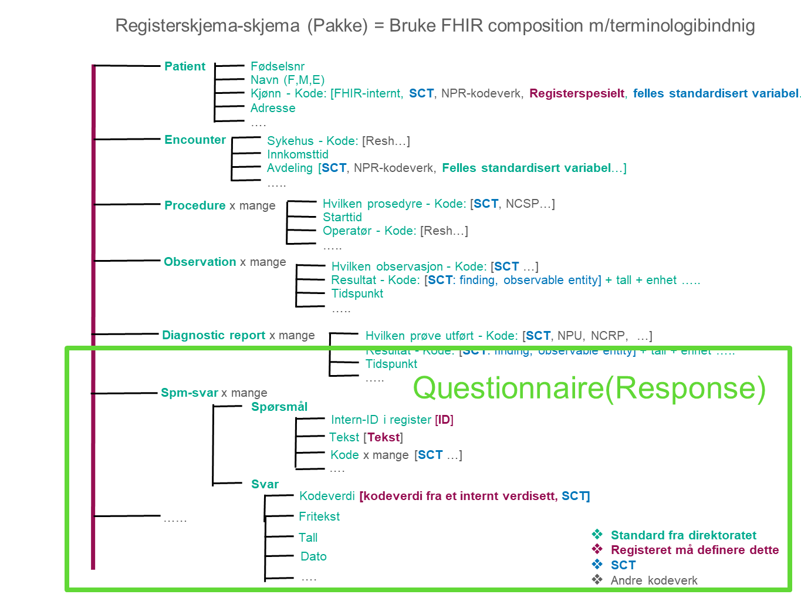
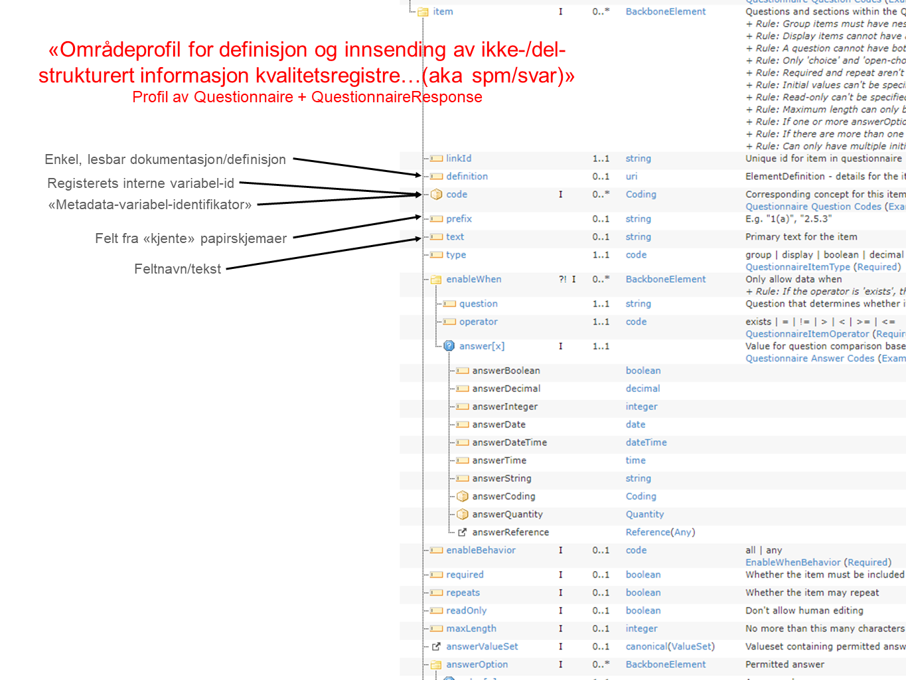
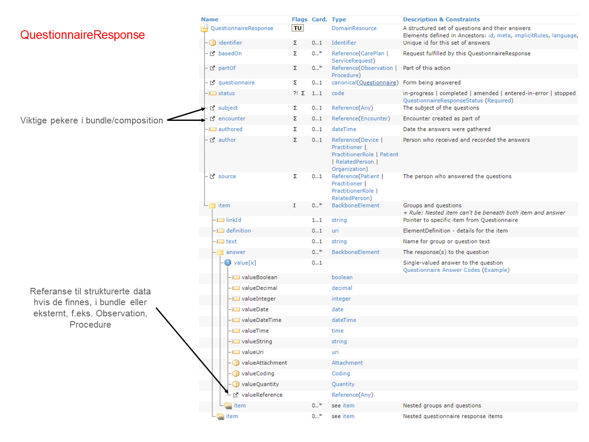

# Innrapportering helseregister

KLADD! UNDER UTARBEIDELSE!

## Plan

Utvikle områdeprofiler og best practice for innrapporering til helseregistere. Fokus på muligheter og overgangsarkitekturer. Behov for å støtte både strukturert, ikke strukturert og delvis strukturert informasjon.

## Behov og krav
- Benytte eksisterende/kommende områdeprofiler og/eller basisprofiler for Patient, Encounter, visse typer Observations. Etablere beste praksis for bruk av nasjonale basis- og områdeprofiler på registerområdet. 
- Profiler og best practice for FHIR Questionnaire og QuestionnaireResponse
  - Questionnaire: Bruk av identifikator for variabel fra metadataregisteret og lokal variabel-identifikator (det enkelte register)
- Etablere god praksis for å kombinere bruk av strukturerte elementer (i form av FHIR ressurser/ profiler) og ustruktuerte elementer (i form av FHIR Questionnaire) 
- Beskrive hvordan profilene kan benyttes med flere arkitekturer, som dokumenter (bundle/composition), portaler, SMART on FHIR etc.
  - REST API i EPJ/fagsystem krever HelseAPI-profiler, f.eks. i bruk med SMART on FHIR. 

## Avhengigheter

Trolig et stort behov for områdeprofiler for Procedure og en rekke Observations m.m. som ikke naturlig vil ligge under denne implementasjonsguiden.

## Aktuelle integrasjonsprosjekter med lignende anvendelse

- Innrapportering Dødsårsaksregisteret _FHI/Skatteetatet/FREG_ (API + portal?)
- All "skjema-basert" innrapportering til helseregistere
- Førerkortfornyelse _Helsedirektoratet/Statens vegvesen_ (SMART on FHIR-app)
- Integrasjon Helseplattformen og kvalitetsregistere _Helse Midt-Norge RHF_

## Brainstorm

NB!: Bundle/composition er brukt under, men områdeprofilene skal være uavhengig av samhandlingsform (som REST API, dokument, messaging etc.)

## Kontaktpersoner

- Linn Brandt
- Espen Stranger Seland - [rockphotog](https://github.com/rockphotog)
